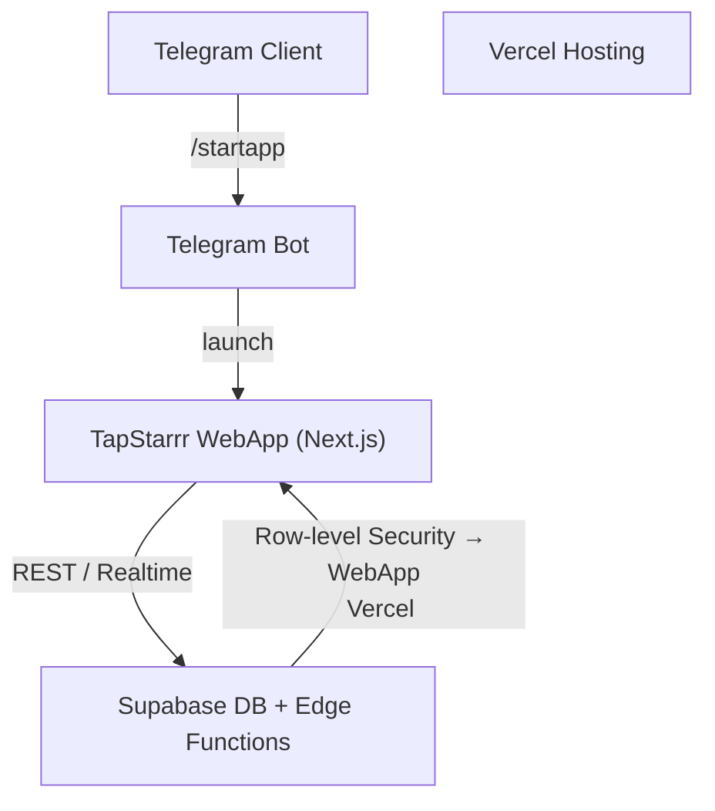

# System Overview

TapStarrr runs entirely inside Telegram’s in-app browser but relies on a classic three-tier layout: client ↔ backend ↔ storage. A Telegram bot provides the deep-link entry-point.

Data-flow summary:
1. **Deep-link launch** – Telegram client opens WebApp URL returned by the bot.
2. **Auth** – WebApp sends `initData` to `/auth/tg` Edge Function → Supabase JWT.
3. **Gameplay** – client calls `/tap`, `/tasks/*`, subscribes to realtime leaderboard.
4. **Persistence** – Supabase enforces RLS; ad-hoc cron jobs use `service_role`.

_No other external services are required in v1._

