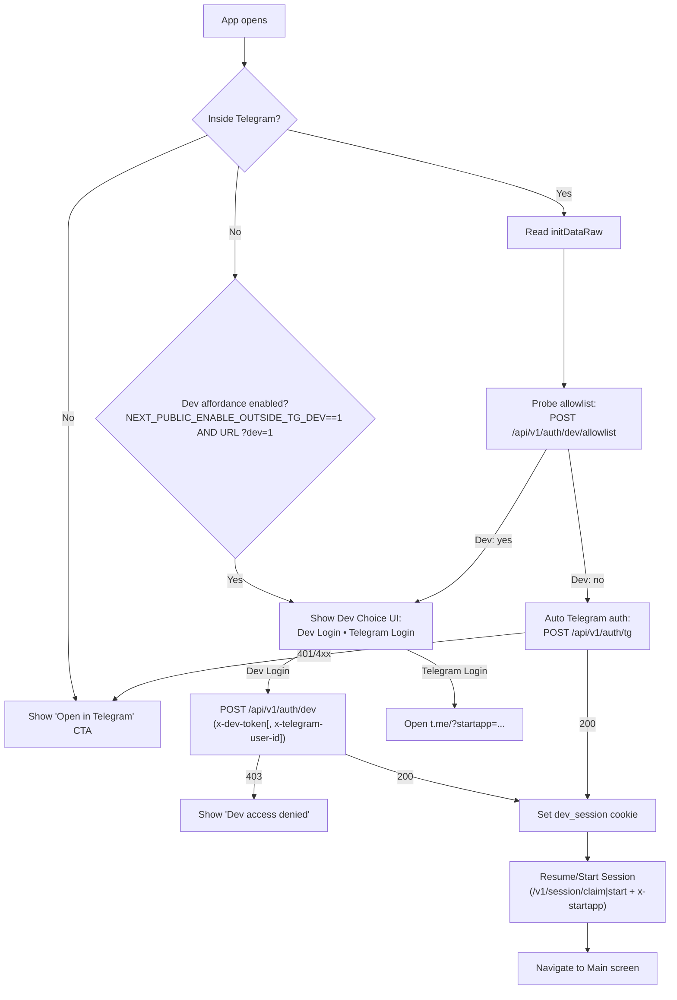

# Telegram integration

## Deep-link patterns (v1)
- Direct Mini App (main only, single app under bot):
  `t.me/<bot_username>?startapp[=<campaign_id>]&mode=<compact|fullscreen>`
- Attachment menu variants: `t.me/<bot_username>?startattach[=<start_parameter>]` and chat-scoped variants.
- Param exposure: read `tgWebAppStartParam` (maps to `startapp`) for routing/attribution; `initDataUnsafe.start_param` only for attachment-menu links.

## JS API usage (subset)
- Telegram.WebApp.ready(), expand(), close()
- Telegram.WebApp.BackButton
- Telegram.WebApp.onEvent('viewportChanged')
- HapticFeedback deferred in v1

## initData validation / auth
- Client obtains `Telegram.WebApp.initData` and posts it to `/api/v1/auth/tg`.
- Server validates HMAC-SHA-256 and TTL using the bot token, upserts user mapping, and sets an httpOnly cookie.
- Never trust `startapp` (or `start_param`) prior to validation.
- Dev allowlist probe: `/api/v1/auth/dev/allowlist` validates `initDataRaw` and reports if the Telegram user is in the dev whitelist; no side effects.

## Payments & Stars
- Out of scope in v1 (pure ad-monetised loop)

## High‑level login decision flow (client)

Notes
- The Dev Choice UI appears to devs inside Telegram (allowlisted) and optionally outside Telegram only when BOTH `NEXT_PUBLIC_ENABLE_OUTSIDE_TG_DEV=1` and the URL contains `?dev=1`.
- `x-startapp` is forwarded to session routes for attribution.

## Auth dependencies (external)

- Telegram WebApp SDK (client)
  - Script tag loaded early to expose `window.Telegram.WebApp` and `initData`:
    - `https://telegram.org/js/telegram-web-app.js`
  - Loaded in Next.js via `<Script strategy="beforeInteractive" />` in `web/src/app/layout.tsx`.

- InitData validator (server)
  - NPM: `@telegram-apps/init-data-node` — validates `initDataRaw` (HMAC‑SHA‑256 with bot token, TTL):
    - Used in `/api/v1/auth/tg` and `/api/v1/auth/dev/allowlist`.
    - Note: the package is deprecated upstream; a compatible alternative is `@tma.js/init-data-node`. Migration is trivial (same intent/API).

- Next.js / Node runtime
  - API routes set `export const runtime = 'nodejs'` to ensure consistent server crypto/runtime on Vercel.

- Database client (server)
  - NPM: `pg` — used by `web/src/lib/db.ts` to upsert `telegram_identities` and `user_profiles` after auth.

## Local dev setup and usage

### Prerequisites
- Set tokens in `web/.env.local` and restart the dev server after changes.

### Enable developer affordance outside Telegram (local browser)
1) In `web/.env.local` set:
   - `NEXT_PUBLIC_ENABLE_OUTSIDE_TG_DEV=1`
   - Option A (quick local use): `ENABLE_RANDOM_DEV_USER=1` (server will allow random dev users without Telegram id)
   - Option B (stricter): leave `ENABLE_RANDOM_DEV_USER=0`, and send `x-telegram-user-id` that exists in `dev_whitelist` when using Dev Login
2) Restart the dev server.
3) Open the app with `?dev=1`, e.g. `http://localhost:3000/?dev=1`.
4) Click “I’m a developer” → Dev Choice UI.
   - Dev Login posts to `/api/v1/auth/dev` with `x-dev-token` (and `x-telegram-user-id` if provided by the UI).
   - On 200, session resume/start will navigate to the main screen.

### Inside Telegram (Mini App)
1) Launch the Mini App from your bot (direct link or menu/attachment).
2) The app reads `initDataRaw` and probes `/api/v1/auth/dev/allowlist`.
   - If allowlisted → Dev Choice UI, pick Dev Login or Telegram Login.
   - If not allowlisted → auto `/api/v1/auth/tg` → session → main screen.

### Disable developer affordance (outside Telegram)
- Default is disabled: `NEXT_PUBLIC_ENABLE_OUTSIDE_TG_DEV=0` or omit the variable.
- Even if the env flag is `1`, the affordance still requires `?dev=1` in the URL.

### Whitelisting a developer (strict mode)
- Insert a row in `dev_whitelist` with your Telegram `tg_user_id`.
- When using Dev Login outside Telegram with strict mode (`ENABLE_RANDOM_DEV_USER=0`), provide `x-telegram-user-id` in the request.

### Troubleshooting
- Dev Login returns 403:
  - Ensure `DEV_TOKEN` (server) equals `NEXT_PUBLIC_DEV_TOKEN` and matches header `x-dev-token` sent by the client.
  - If `ENABLE_RANDOM_DEV_USER=0`, either:
    - pass a valid `x-telegram-user-id` that is present in `dev_whitelist`, or
    - temporarily set `ENABLE_RANDOM_DEV_USER=1` for local development.
- Telegram Login fails (401): likely invalid/expired `initDataRaw`; relaunch the Mini App from Telegram.
